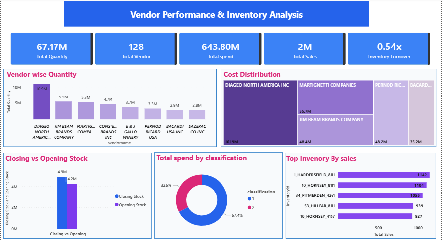

# Vendor-Performance-Inventory-Analysis
Power BI dashboard analyzing vendor performance, inventory movement, spending, and sales.
# Vendor Performance & Inventory Analysis

## 📊 Project Overview

This Power BI dashboard analyzes vendor performance, purchasing spend, inventory movement, and sales performance to identify opportunities for better inventory planning and vendor management.

## 🎯 Business Problem

The objective is to understand vendor contribution, purchasing spend, inventory levels, and sales performance and identify potential inventory inefficiencies.

## 🔍 Analysis Performed

- Vendor-wise quantity analysis
- Cost distribution by vendor
- Opening vs. closing inventory analysis
- Spend analysis by classification
- Top inventory items by sales
- Inventory turnover analysis

## 📌 Key KPIs

| KPI | Value |
|---|---:|
| Total Quantity | 67.17M |
| Total Vendors | 128 |
| Total Spend | 643.80M |
| Total Sales | 2M |
| Inventory Turnover | 0.54x |

## 💡 Key Insights

- A small number of vendors contribute significantly to overall purchasing quantity and spend.
- Inventory levels show a difference between opening and closing stock.
- The top-selling inventory items contribute significantly to total sales.
- Inventory turnover of **0.54x** indicates that inventory was turned over less than once during the analyzed period.

## 📈 Business Impact

The dashboard can help supply chain teams:

- Identify high-volume vendors
- Monitor purchasing spend
- Evaluate inventory movement
- Identify potential slow-moving inventory
- Improve purchasing and inventory planning
- Support data-driven vendor management

## 🛠️ Tools & Technologies

- Power BI
- DAX
- Power Query
- SQL
- Excel

## 📷 Dashboard

